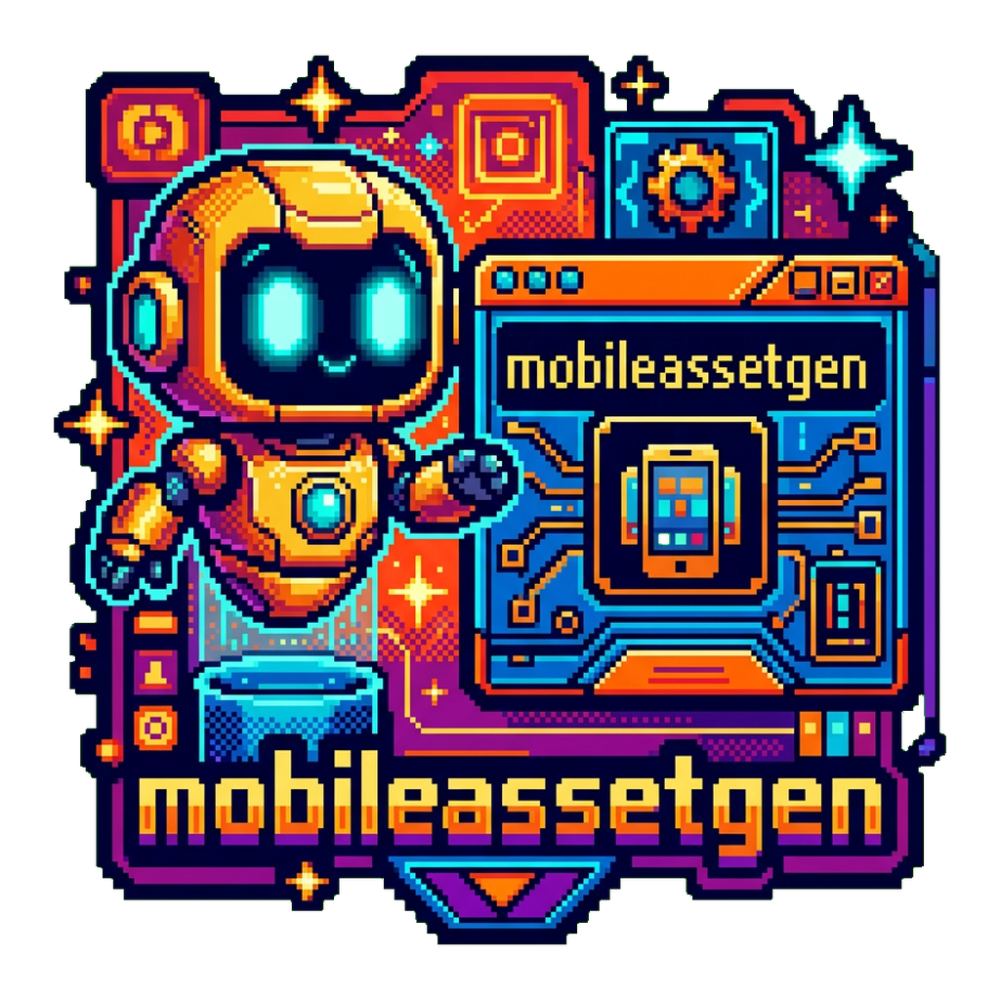

<div align="center">
  

  [](https://nextjs.org/)
  [](https://www.typescriptlang.org/)
  [](LICENSE)
  [](https://tailwindcss.com/)

  **📱 Generate production-ready Android app assets from a single text prompt — icons, round icons, notifications, and Play Store graphics, all in seconds ⚡**
</div>

---

**The Pain:** Creating Android app assets manually means wrestling with density buckets, pixel-perfect sizing across 5 DPI variants, circular masks, notification silhouettes, and Play Store requirements — easily hours of tedious design work.

**The Solution:** Describe your app in plain text. AI generates a logo and feature graphic, then client-side Canvas processing produces all 20 required Android assets with correct dimensions, transforms, and directory structure.

**The Result:** From text prompt to downloadable ZIP with complete `mipmap-*/` and `drawable-*/` resource directories in under a minute.

---

## ✨ Features

- **🤖 AI-Powered Generation** — Uses Google Gemini via OpenRouter to create professional logos and feature graphics from text descriptions
- **📐 20 Android Assets** — Launcher icons, round icons, notification silhouettes, Play Store icon, and feature graphic across all density buckets (mdpi → xxxhdpi)
- **🔄 Smart Image Processing** — Center-crop resizing, circular masking, and halo-free silhouette generation with graduated alpha blending
- **📦 One-Click ZIP Download** — All assets packaged with correct Android resource directory structure (`mipmap-*/`, `drawable-*/`)
- **🔒 Fully Client-Side** — No backend, no server uploads. Your API key and images never leave your browser
- **📊 Google Analytics Ready** — Automatically sends page views plus generation and download events when `NEXT_PUBLIC_GA_MEASUREMENT_ID` is configured
- **🎨 Dark Theme UI** — Polished interface with progress tracking, asset previews, and individual downloads

## 🚀 Quick Start

### Prerequisites

- [Node.js](https://nodejs.org/) 18+
- An [OpenRouter API key](https://openrouter.ai/)

### Install & Run

```bash
git clone https://github.com/tsilva/mobileassetgen.git
cd mobileassetgen
npm install
npm run dev
```

Open [http://localhost:3000](http://localhost:3000), enter your OpenRouter API key, describe your app, and hit **Generate Assets**.

### Optional Analytics

If you want to send analytics to Google Analytics 4, set:

```bash
NEXT_PUBLIC_GA_MEASUREMENT_ID=G-XXXXXXXXXX
```

When present, the app sends:

- `page_view`
- `generate_assets_started`
- `generate_assets_completed`
- `generate_assets_failed`
- `download_assets_zip`
- `download_asset_single`

## 📐 Generated Assets

| Category | Assets | Sizes | Directory |
|----------|--------|-------|-----------|
| **Launcher Icons** | 5 density variants | 48px → 192px | `mipmap-*/ic_launcher.png` |
| **Round Icons** | 5 density variants | 48px → 192px | `mipmap-*/ic_launcher_round.png` |
| **Notification Icons** | 5 density variants | 24px → 96px | `drawable-*/ic_notification.png` |
| **Play Store Icon** | 1 | 512×512px | `play_store_icon.png` |
| **Feature Graphic** | 1 | 1024×500px | `feature_graphic.png` |

> **20 total assets** across mdpi, hdpi, xhdpi, xxhdpi, and xxxhdpi density buckets.

## 🔧 How It Works

```
Text Prompt → AI Logo Generation → Canvas Processing → 20 Android Assets → ZIP Download
```

1. **Describe your app** — Enter a text description of your app concept
2. **AI generates a logo** — OpenRouter calls Gemini to create a 1:1 logo image
3. **Canvas processes variants** — Client-side transforms produce launcher, round, and notification icons across all density buckets
4. **AI generates feature graphic** — A second call creates a 16:9 promotional banner
5. **Download everything** — Individual assets or a complete ZIP with Android resource structure

### Image Transforms

| Transform | Used For | Technique |
|-----------|----------|-----------|
| **Resize** | Launcher & Play Store icons | Center-crop with aspect ratio detection |
| **Circle-crop** | Round icons | Circular mask with centered scaling |
| **Silhouette** | Notification icons | Corner-based background detection + graduated alpha blending |

## 🛠️ Tech Stack

| Layer | Technology |
|-------|-----------|
| Framework | Next.js 16 (React 19) |
| Language | TypeScript 5 |
| Styling | Tailwind CSS v4 |
| AI Model | Google Gemini 3.1 Flash via OpenRouter |
| Image Processing | Canvas API |
| ZIP Packaging | JSZip + FileSaver.js |

## 📁 Project Structure

```
src/
├── app/
│   ├── page.tsx            # Main page — state machine & generation orchestration
│   ├── layout.tsx          # Root layout with fonts and analytics
│   └── globals.css         # Dark theme & animations
├── components/
│   ├── GoogleAnalytics.tsx # GA4 script loader + SPA page views
│   ├── Header.tsx          # App title & branding
│   ├── ApiKeyInput.tsx     # API key input (localStorage)
│   ├── PromptForm.tsx      # Text prompt & generate button
│   ├── ProgressIndicator.tsx # 4-step pipeline tracker
│   ├── AssetPreview.tsx    # Asset grid display
│   ├── AssetCard.tsx       # Individual asset card
│   └── DownloadControls.tsx # ZIP download button
├── lib/
│   ├── analytics.ts        # GA4 helpers and event tracking
│   ├── openrouter.ts       # OpenRouter API integration
│   ├── imageProcessor.ts   # Canvas-based image transforms
│   └── zipBuilder.ts       # ZIP creation utilities
├── config/
│   └── assetConfig.ts      # Asset specifications & categories
└── types/
    └── index.ts            # TypeScript interfaces
```

## 📜 License

[MIT](LICENSE) © Tiago Silva
